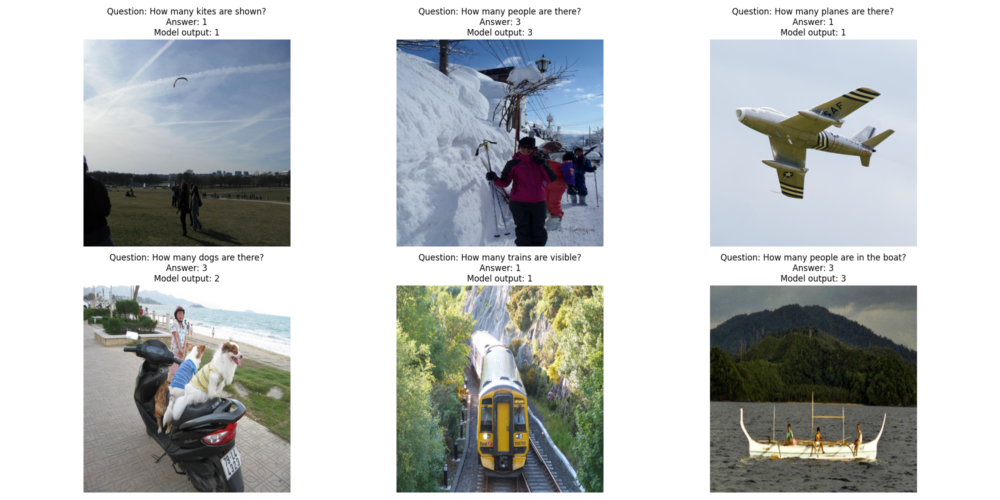
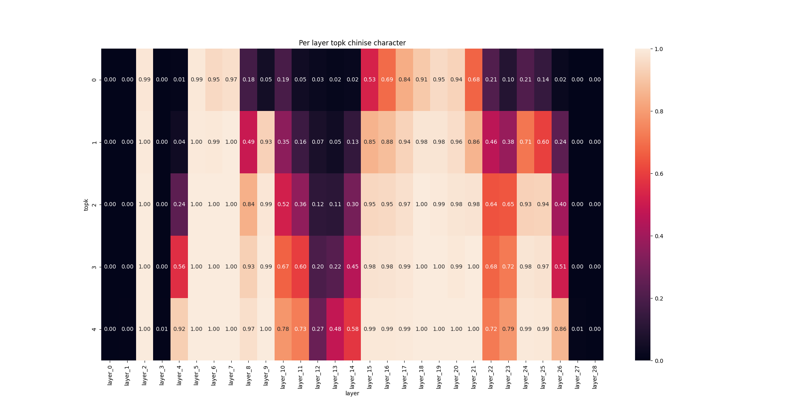
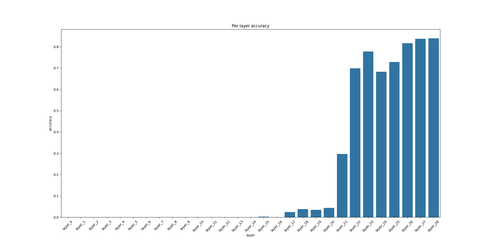
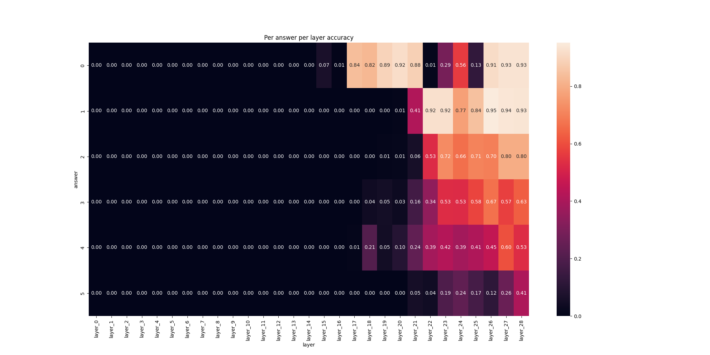

# Отчет о работе

Feel free to translate this from russian using any avaliable translator.

Этот текст на русском, так как мне будет проще выразить на нем мысли. 

## Logit lens

Основа метода интерпретации трансформерных моделей logits lens заключается в проекции скрытых признаков в пространство токенов.
Так как трансформер применяет последовательно операции вида $x \to x + f(x)$, то применение проекции к промежуточным скрытым состояниям получаются осмысленные. 

## Dataset

В данной работе я взял за основу датасет [TallyQA](https://www.manojacharya.com/tallyqa.html), так как хотел посмотреть на каких этапах мультимодальная модель сможет правильно отвечать на вопросы подсчета числа объектов на картинке. В датасете для ускорения работы и упрощения процесса я оставил только легкие вопросы (определение легких вопросов можно прочитать на официальной странице датасета) и где ответ это числа меньше 6. 

## Model

Для изучения я взял [Qwen2-VL-2B-Instruct](https://huggingface.co/Qwen/Qwen2-VL-2B-Instruct) как легкую мультимодальную модель из open source. 

## Additional work

В процессе работы я обнаружил, что модель "думает" на китайском языке (что неудивительно, если знать кем был обучени Qwen). Для этого я создал словарь перевода цифр в возможные китайские символы. Сначала была грубая прикидка с помощью скрипта [src/get_chinise_translation.py](src/get_chinise_translation.py), на которую можно посмотреть [здесь](number_to_chinise.json). Далее словарь был в ручном формате очищен, используя переводчик, откуда получили [эту версию словавя](number_to_chinise_filtered.json).

## Pipeline

На вход подавался вопрос вида `<image><question from TallyQA>. Output single word with exact number.`. Далее модель инференсилась методом `.generate` из библиотеки `transformers`, который применяет beam search для оптимального ответа. В подавляющем большинстве случаев ответ был ожидаемым, а именно одна единственная цифра. Далее все промежуточные состояния для получения этого токена-цифры проецировались в пространство токенов и сохранялись их декодированная версия с вероятностями. На полный выход можно просмотреть в релизах. 

Визуализация входных данных:

## Final metrics

### Chinise 

Интересно было увидеть, что промежуточные токены часто отвечают за иероглифы. На картинке снизу по оси x отложен номер скрытого слоя, по оси y - есть ли среди первых $k$ токенов (в нумерации с нуля) хотя бы один иероглиф. Первые слои не предоставляют интереса, так как обычно там различный мусор. Но начиная с центральных слоев видим, что первые 5 токенов почти всегда отвечают за иероглиф. Работа последних слоев заключается буквально в переводе на английский 

### Accuracy

Неудивительно, что со временем модель лучше и лучше отвечает на поставленную задачу

Если же смотреть стратифицировано на число объектов, которое надо было найти, то видим чуть иную картину. По оси x тут все еще номер скрытого слоя, по оси y - таргет, то есть сколько объектов требовалось найти на картинке.

Видим, что в зависимости от тартега "скорость реакции" меняется, а так же точность ответа. Например, понять, что на картинке 0 требуемых объектов, удается быстро. С увеличением величины тартета метрика съезжает "правее", то есть модель позже угадывает ответ. 

Но стоит отметить, что это может быть связано и с тем фактом, что модель в целом хуже отвечает на вопросы, где объектов больше 2, откуда и более поздняя "реакция"

### Conclusion

В работе было обнаружено, что
- `Qwen2-VL-2B` "думает" на китайском, так как скрытые состояния промежуточных слоев соответствуют китайским иероглифам
- Модель имеет отличные метрики в задаче подсчета числа объектов на изображении уже на 22 слое из 29
- Но эти метрики сильно зависят от числа предсказываемых объектов

## Further work

- Следует взять больше данных
    - Взять не 5000 вопросов, а больше
    - Включить сложные вопросы в выборку и изучить результаты
- Посмотреть на другие модели
    - Либо взять другую "базу", например LLaVa
    - Либо другие размеры, например 7B
- Для скорости работы и экономии видео-памяти изображения сжимались в 512x512, хотя Qwen2-VL умеет работать с произвольным разрешением
